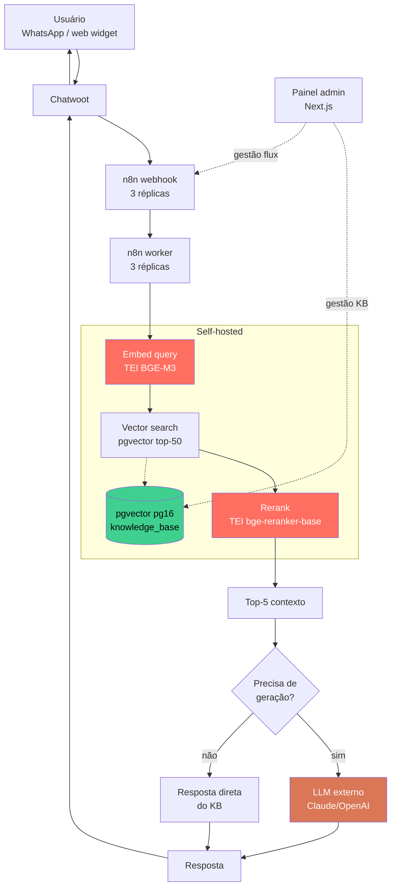

<h1 align="center">🧬 Self-Hosted Conversational RAG Stack</h1>

<p align="center">
  <strong>Stack completa de RAG conversacional 100% on-premise — embeddings + reranking sem chamada de API externa.</strong><br/>
  <sub>Extraído de implementação real em produção (~1.300 execuções/dia, dados anonimizados).</sub>
</p>

<p align="center">
  
  
  
  
</p>

---

## 📌 O problema

Construir RAG **sem depender de OpenAI/Cohere pra embeddings** é trivial em PoC e dolorido em produção. Você precisa resolver:

1. **Custo previsível** — cada chamada de embedding externo escala linear, batch processing fica caro
2. **Latência sub-segundo** — round-trip pra API externa adiciona 200-800ms por consulta
3. **Soberania de dados** — saúde, jurídico, financeiro, gov: muitos verticais não podem mandar conteúdo sensível pra serviço externo
4. **Reranking** — vector search puro tem precisão baixa; precisa de reranker, mas reranker externo dobra a latência

## 🎯 A solução

Stack open-source orquestrada em Docker Swarm + Traefik:

- **Embeddings:** Hugging Face TEI rodando `BAAI/bge-m3` localmente (multilíngue, 8192 tokens, ~600 docs/s em CPU)
- **Reranker:** TEI rodando `BAAI/bge-reranker-base` (precisão >90% no MTEB pra PT-BR)
- **Vector DB:** PostgreSQL com extensão `pgvector` (pg16) — sem precisar de Weaviate/Pinecone/Qdrant separado
- **Orquestração de fluxo:** n8n em modo queue (1 editor + 3 webhooks + 3 workers + Redis)
- **Canal:** Chatwoot v4.8+ (WhatsApp/web widget/Telegram)
- **Painel admin:** Next.js consumindo Claude API pra geração final (o RAG resolve o "o que buscar", LLM externo só compõe resposta)
- **Reverse proxy + TLS:** Traefik v3 com Let's Encrypt automático

## 🏗️ Arquitetura



## 🛠️ Stack

| Camada | Tecnologia | Self-hosted? |
|---|---|---|
| Embeddings | HF TEI + BGE-M3 | ✅ |
| Reranking | HF TEI + bge-reranker-base | ✅ |
| Vector DB | PostgreSQL 16 + pgvector | ✅ |
| Orquestração | n8n (modo queue) | ✅ |
| Canal | Chatwoot v4.8 | ✅ |
| Painel admin | Next.js 14 + Prisma | ✅ |
| LLM geração | Claude / OpenAI (configurável) | ⚠️ externo |
| Proxy + TLS | Traefik v3 + Let's Encrypt | ✅ |
| Cluster | Docker Swarm (1+ node) | ✅ |
| Backup | pg_dump cron + volume snapshot | ✅ |

## 📦 O que tem nesse repo

```
.
├── stacks/
│   ├── 00-network.yml              # rede overlay Swarm
│   ├── 01-traefik.yml              # proxy + ACME
│   ├── 02-postgres.yml             # pgvector pg16 (KB) + pg14 (n8n queue)
│   ├── 03-redis.yml                # Redis pra n8n queue + Chatwoot
│   ├── 04-tei-embedder.yml         # TEI BGE-M3
│   ├── 05-tei-reranker.yml         # TEI bge-reranker-base
│   ├── 06-n8n.yml                  # editor + webhooks + workers (modo queue)
│   ├── 07-chatwoot.yml             # app + sidekiq
│   ├── 08-portainer.yml            # gestão Swarm
│   └── 09-admin-board.yml          # painel Next.js (template)
├── sql/
│   ├── 001_pgvector.sql            # CREATE EXTENSION + schema KB
│   ├── 002_seed_kb.sql             # exemplo de docs com embedding
│   └── 003_indexes.sql             # HNSW + ivfflat
├── workflows/
│   ├── 01-busca-kb.json            # workflow n8n de busca
│   ├── 02-handoff-humano.json      # protocolo de handoff
│   └── 03-orquestrador.json        # roteador principal
├── admin-board/
│   ├── README.md                   # painel Next.js completo
│   ├── prisma/                     # schema + migrations
│   └── ...
├── scripts/
│   ├── bootstrap.sh                # provisiona Swarm + secrets + stacks
│   ├── ingest-docs.py              # CLI pra ingestar PDFs/MD na KB
│   └── rotate-secrets.sh           # rotação Swarm secrets
├── docs/
│   ├── why-self-hosted.md
│   ├── bge-m3-vs-openai-embeddings.md
│   ├── reranker-rationale.md
│   └── operations.md
├── docker-compose.dev.yml          # dev local (single-node)
└── README.md
```

## 🚀 Como rodar localmente

```bash
git clone https://github.com/LufeDigitalWave/self-hosted-rag-stack
cd self-hosted-rag-stack

# dev single-node (sem Swarm)
docker compose -f docker-compose.dev.yml up -d
docker compose -f docker-compose.dev.yml exec postgres psql -U postgres -f /sql/001_pgvector.sql

# popular KB de exemplo
python scripts/ingest-docs.py --dir ./samples --table knowledge_base

# testar embedding
curl -X POST http://localhost:8080/embed -d '{"inputs":"qual é a política de cancelamento?"}'

# testar fluxo completo via Chatwoot widget
open http://localhost:3000
```

Pra deploy em **Docker Swarm** (1+ nodes):

```bash
./scripts/bootstrap.sh init manager-node-1
for f in stacks/*.yml; do docker stack deploy -c "$f" "$(basename "$f" .yml)"; done
```

## 🔐 Secrets management

⚠️ **NUNCA** ponha secrets em `env:` direto no compose. Esse repo usa:

- `docker secret create` pra LLM API keys, Postgres password, GitHub PAT
- Mount em `/run/secrets/*` (read-only, 0400)
- Script `scripts/rotate-secrets.sh` faz rotação sem downtime
- `.env.example` mostra estrutura, **nunca** `.env` real no Git

Ver [docs/operations.md](docs/operations.md#secrets).

## 📊 Resultados (caso real, anonimizado)

| Métrica | Valor |
|---|---|
| Execuções n8n/dia | ~1.300 |
| Latência média RAG (embed → rerank → top-5) | < 600ms |
| Custo embeddings | $0 (vs ~$0.0001/1k tokens OpenAI) |
| Recall@5 (validação manual amostra de 200) | ~91% |
| Uptime últimos 5 meses | > 99.8% |
| Hardware | 1 node, 8 vCPU + 32GB RAM (AMD EPYC) |

## 🧪 Workflows incluídos

- ✅ **Busca KB** — embed → vector search → rerank → top-5
- ✅ **Handoff humano** — detecta intenção → pausa bot → notifica time
- ✅ **Orquestrador** — roteia entre qualificação, FAQ, transação, escalação
- ✅ **Ingestão** — CLI Python pra subir PDF/MD/CSV com chunking semântico
- ✅ **Reports** — agregação Postgres → painel admin

## 📚 Leitura recomendada

- [docs/why-self-hosted.md](docs/why-self-hosted.md) — quando vale a pena e quando não
- [docs/bge-m3-vs-openai-embeddings.md](docs/bge-m3-vs-openai-embeddings.md) — benchmark PT-BR
- [docs/reranker-rationale.md](docs/reranker-rationale.md) — por que reranker é não-negociável
- [docs/operations.md](docs/operations.md) — backup, restore, rotação, scaling

## 🤝 Quando NÃO usar esse stack

Seja honesto:

- ❌ Volume < 10k consultas/mês — chamar OpenAI sai mais barato que rodar TEI
- ❌ Equipe sem alguém confortável com Docker Swarm — gerencia overhead
- ❌ Catálogo de documentos < 1k — pgvector com KNN exato resolve, sobra TEI
- ❌ Requisito de compliance que exige certificações cloud (SOC2/HIPAA managed)

Pra esses casos, RAG SaaS (Pinecone + OpenAI) ou Supabase pgvector resolvem com menos atrito.

## 📄 Licença

MIT.
